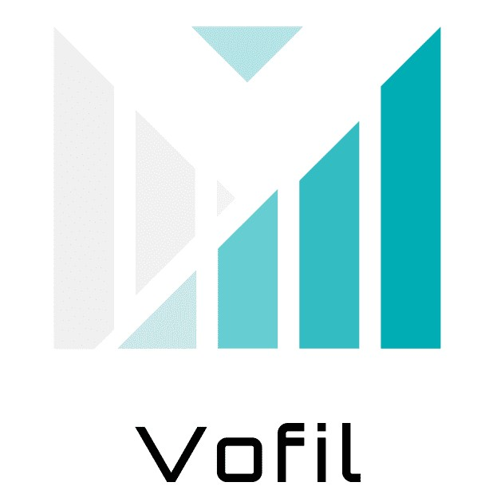

# [ vofil-frontend ]



## 실행 방법
### 1. 설치 항목
+ node.js 최신 버전
+ yarn 최신 버전
+ intelliJ 최신 버전

### 2. vofil-frontend 설치 위치

**vofile-backend/src/main**에서 git clone 해주시면 됩니다

### 3. 설치 과정
1. [Node.js](https://nodejs.org/en/) 이곳에서 LTS 버전을 설치합니다.
2. 터미널에서 다음 문장을 입력하십시오
    ```bash
    npm install --global yarn
    ```
3. [IntelliJ IDEA](https://www.jetbrains.com/idea/) 이곳에서 최신 버전 인텔리제이를 다운로드 하십시오.
4. 2번 항목에서 설명한 위치에서 터미널을 열고 다음 문구를 입력하십시오.
    ```bash
    git clone git@github.com:Vofil/vofil-frontend.git
    ```
5. **vofile-backend/src/main/vofil-frontend** 위치로 이동하여 터미널을 여십시오.
6. 이동한 위치에서 터미널을 열고 다음 문구를 입력하여 리액트를 실행합니다.
    ```bash
    yarn start
    ```
### 4. 패키지 오류가 발생한 경우
git clone을 하더라도 패키지가 설치되지 않았다는 오류를 만날 수 있습니다. 
그럴 땐 다음 패키지들을 수동 설치 해주십시오.

#### 4-1. 패키지 설치 위치
**vofile-backend/src/main/vofil-frontend**
#### 4-2. 패키지 설치 방법
위에서 설명한 위치에서 터미널을 열고 **yarn add [패키지명]** 이라고 입력하십시오.
#### 4-3. 패키지 설치 항목
+ react-canvas-draw
+ react-image-crop
+ react-zoom-pan-pinch
+ react-awesome-modal
+ react-icons
+ react-router-dom
+ recharts
+ styled-components


